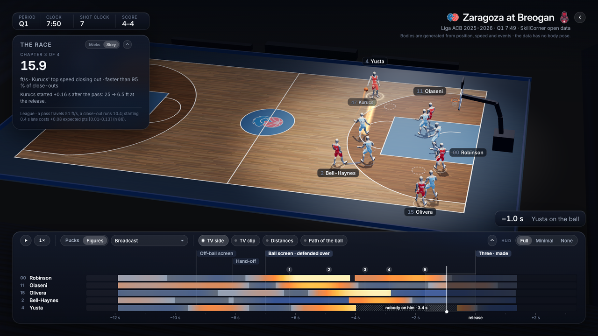
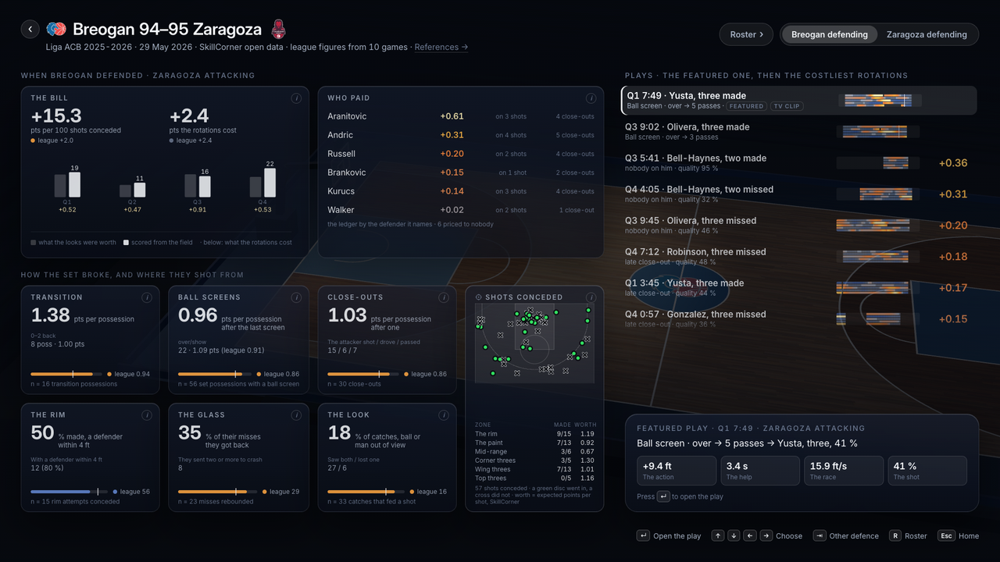

# Where the shot was born

Man-to-man defence as a system in tension, read backwards from the shot. Built on
[SkillCorner's basketball open data](https://github.com/SkillCorner/opendata-basketball): Liga ACB 2025-2026, ten games of tracking.



## Run it

Code and documentation only: one command downloads the public data, everything else is generated locally. Needs
[uv](https://docs.astral.sh/uv/), git, git-lfs and a browser.

```bash
uv sync
uv run courtlab fetch                # SkillCorner's dataset (~700 MB) into data/
uv run courtlab league               # the league figures every screen quotes
uv run courtlab report --all         # every match as a defensive staff reads it
uv run courtlab export --per-game 1  # the best story of every game (or --best N)
uv run courtlab serve                # http://localhost:8000, no build step
uv run courtlab site                 # the same viewer as a static folder, for any host
uv run --group dev pytest -q         # 21 checks; run them after export and report
```

`fetch` is skipped if a clone sits at `../opendata-basketball` or `COURTLAB_DATA` points to one.

## The screens

**Home** lists the games on your machine. **The play** is the possession in 3D: pucks or generated figures, and eight cameras — the
Director cuts with the play from SkillCorner's labels, and one seat sits behind a player's eyes. **The match** reads one game as a
coach reads a defence: the bill by quarter, who paid, how the set broke, where they shot from, and then its plays. **The roster** is
one profile per player; **Players** puts one point per player and game against five questions a coach asks. **The references** name
every term the screens use and mark each figure as SkillCorner's, computed here, or only drawn — the same definitions open from an
`i` beside any card. Keyboard-first throughout.

## How it reads a possession

A defender's **normal spot** is a weighted point between his man, the ball and the hoop (Franks, Miller, Bornn and Goldsberry, 2015;
weights refitted on these games). How far he stands **beyond his normal spot** is the one quantity the colours show: blue tighter,
amber pulled away. The **tension strip** draws it for every attacker across the possession, so a broken rotation is visible before the
shot is. Four chapters tell the play, each with one number and one league figure. For the Zaragoza three at Breogán (Q1 7:49):

- **The action**, from 1 s before the origin to 1.2 s after: the screener stands **+9.4 ft** beyond his normal spot.
- **The help**, up to the pass that fed the shooter: **3.4 s** with nobody on Yusta; Aranitović let go at −4.0 s to take Robinson.
- **The race**, from the pass to the release: Kurucs closes out at **15.9 ft/s**, faster than 95 % of close-outs, starting 0.16 s late.
- **The shot**: **41 %** by SkillCorner's shot model; the late start cost 0.06 expected points.

## What the ten games say

Computed by `courtlab league`, never typed in. Intervals resample whole games; nothing is quoted under n = 30.

- A catch with nobody assigned to the shooter for 1 s or more is worth **1.10** expected points [1.00, 1.18] (n = 182), against
  **0.93** [0.90, 0.96] with his defender in place (n = 352).
- Passes after the last labelled action: 0 → 1 → 2 give **0.88 → 1.09 → 1.16** expected points (n = 508 / 319 / 85).
- A pass travels at 51 ft/s, a close-out runs at 10.4. Starting 0.4 s late costs **+0.08** expected points [+0.02, +0.13] (n = 86).
- At the rim with a defender within 4 ft, **56 %** go in [50, 63]; with nobody there, **81 %** [72, 90] (n = 238 / 57).
- The rotation ledger: **2.36** expected points per team and game — late close-outs 0.94, nobody on him 1.05, help not
  recovered 0.37 (n = 512).

The **price of a rotation** moves one thing — the defender's distance at the release — along SkillCorner's own
quality-versus-distance slope, fitted per zone. A model on top of SkillCorner's model, and an upper bound; it says so on screen.

## The match report



Per defending side, in a coach's order: what it cost, who paid, how the set broke (transition, ball screens, close-outs, the look),
inside (the rim, the glass), and every shot conceded on the half court — each figure with its league line and its n. The look asks
what a player could see from positions alone ([docs/the_look.md](docs/the_look.md)): of five predictions written before running, two
held.

## Honesty

- Every number comes from the data. A broadcast clip the viewer can show beside the animation is never read as data
  ([docs/tv_clip.md](docs/tv_clip.md)).
- The data has no body pose. The figures (one CC0 body by Quaternius, posed by our own rules), their cloth, the eye-level gaze and
  the ball's bend into the ring are illustrations, labelled as such. Kits and the floor are templates in each club's classic colours;
  the crests are the clubs' trademarks, and the mark on Home is SkillCorner's, shown to credit the data.
- The raw tracking frame is a mirror of the real court and the clocks run 0.6 s behind the arena:
  [docs/data_notes.md](docs/data_notes.md). What did not survive testing:
  [docs/what_did_not_hold.md](docs/what_did_not_hold.md). Names and units: [docs/glossary.md](docs/glossary.md). Every file the
  package writes: [docs/contracts.md](docs/contracts.md).
- Tests check the shooter's position at the release, his distance to his defender and who takes the rebound against SkillCorner's
  own measurements.

## Layout

`src/courtlab/` is the package: `equilibrium` (the normal spot), `league`, `glass`, `rotations` (the ledger), `chapters`,
`possession`, `report`, `find`, `serve`, `cli`. `src/courtlab/viewer/` holds the screens on one shared world, with no build step.
`scripts/` has the analyses behind the figures, the reference stills and the console check.

MIT licence for the code ([LICENSE](LICENSE)); the data is SkillCorner's, MIT; three.js (MIT), Inter (OFL) and a CC0 body by
Quaternius are vendored.

---

_Analyst Track submission for the SkillCorner X PySport Analytics Cup._

## Analyst Track Abstract Template (max. 300 words)
#### Introduction

A shot is the last thing that happens in a possession. This is a Python package and a viewer that read one backwards from it, in
four chapters: the action that opened it, who paid for the help, the race to close out, and the shot. A defender's **normal spot**
is a weighted point between his man, the ball and the hoop (Franks, Miller, Bornn and Goldsberry, 2015; weights refitted on these
ten games). How far he stands beyond it is the one quantity the colours carry. On top of it sits the **price of a rotation**: the
expected points a conceded shot would have lost had the defender been closer at the release, moved along SkillCorner's own
quality-versus-distance slope, fitted per zone. A model on top of SkillCorner's model, and an upper bound; the screens say so.
Everything comes from the tracking and the labels; nothing from video.

#### Usecase(s)

Three, in the order a defensive staff works. **The match report** reads one game as a coach reads a defence: what it cost, who
paid, how the set broke, and every shot conceded, each figure against its league line and its n. **The plays** open at the pass
that fed the shot, in 3D, from eight cameras — one of them behind a player's eyes — so a broken rotation can be shown rather than
argued. **The roster and players pages** carry the same measures down to the individual. A references page names every term and
marks each figure as SkillCorner's, computed here, or only drawn.

#### Potential Audience

Assistant coaches and defensive staff, who get a ledger with names on it, not a team total. Video analysts, for whom it
answers *why* beside footage they already have. Club data analysts, as a worked, open example of building on tracking data.

---

## Video URL

---

## Run Instructions

The submission is the web app; the URL below runs it with no setup. To run everything locally instead, including the analyses and
the tests, follow **Run it** at the top of this README. The tracking data is never stored here: `courtlab fetch` loads it from
SkillCorner's own repository.

---

## [Optional] URL to Web App / Website

https://sfsilvajacquier.github.io/where-the-shot-was-born/
